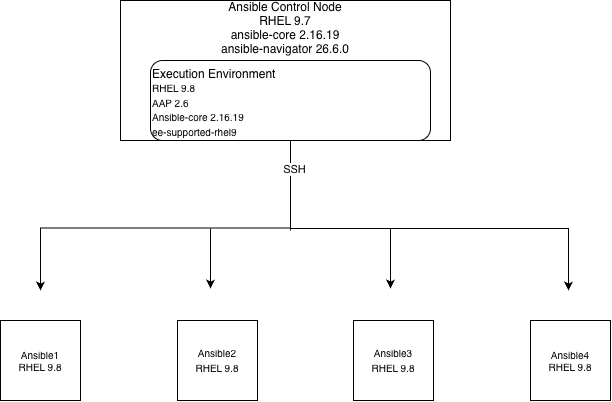

# Project Name: RHCE Prep Lab

## Overview
This repository contains my Ansible and RHCE study exercises, lab configuration, and personal practice work while preparing for the Red Hat Certified Engineer (RHCE) exam. The Practice_Exam directory contains my personal implementations of practice exercises and tasks. The original questions and instructional material are not reproduced here.
**Outcome:** This lab was used as my primary hands-on study environment for the Red Hat Certified Engineer (RHCE) exam, which I subsequently passed.
## Lab Environment
## Control Node
| **Component** | **Version** |
| --- | --- |
| **Ansible Core:** | 2.16.19 |
| **Ansible-navigator:** | 26.6.0 |
| **Ansible-Automation-Platform:** | 2.6 |
| **Python:** | 3.9.23 |
| **Collections:** | `community.general 13.3.0`, `ansible.posix 2.2.2`, 'community.crypto 3.3.0', 'redhat.rhel_system_roles 1.120.6' |
| **OS:** | RHEL 9.7 |
| **Lab Environment:** | VMware Fusion 13.6.1 |
## Managed Hosts
| **Component** | **Version** |
| --- | --- |
| **OS:** | RHEL 9.7 |
## Execution Environment
| **Component** | **Version** |
| --- | --- |
| **Red Hat Ansible Automation Platform:** | 2.6 |
| **Execution Environment:** | `ee-supported-rhel9` |
| **Execution Environment version:** | 2.0.0 |
| **RHEL:** | 9.8 |
| **Ansible Core:** | 2.16.19 |
| **ansible-navigator:** | 26.6.0 |
| **Python:** | 3.12.13 |
| **Jinja:** | 3.1.6 |
| **Architecture:** | ARM64 |
| **Image digest:** |
  `sha256:63ccd8ad711852fb955c10b1ee57fd3895e50220ce5f1877e58130a7ff8128a6` |

## Lab Architecture
    
  

## Project Structure
* 'inventory' example static inventory for lab
* 'ansible.cfg' example baseline ansible.cfg
* 'ansible-navigator.yml' example navigator config
* 'requirements.yml' Required collections for using example playbooks
* '/objectives/create-plays-playbooks' Practice with Jinja templates, loops and conditionals
* '/objectives/configure-managed-nodes' Setup and static IP address for new managed hosts
* '/objectives/automate-standard-rhcsa-tasks' Playbooks that manage default target, setup repository, setup storage and manage users and groups
* '/Practice_Exam' My solutions to third-party exercises covering the majority of the test objectives

## Practice_Exam
The `Practice_Exam/` directory contains my implementations of
RHCE-style automation exercises.

The exercises cover areas including:
- User and group management
- SSH configuration
- Cron
- LVM/storage
- Repository configuration
- `/etc/hosts`
- Jinja2 templates
- Roles
- Ansible Vault
- Reporting
- Inventory management

| **Exercise** | **Ansible concept** | **Objective** |
| --- | --- | --- |
| create_users.yml | ansible.builtin.user | user management |
| cron_job.yml | ansible.builtin.cron | scheduled tasks |
| lv_creation.yml | LVM modules | storage devices |
| call_motd_role.yml | roles | role usage |
| generate_report.yml | templates | Jinja2 |
| etc_hosts.yml | templates | configuration management |

## Getting Started
1. Register control node with subscription-manager register
2. Run sudo dnf update to update RPM repositories
3. subscription-manager repos --enable ansible-automation-platform-2.6-for-rhel-9-aarch64-rpms
4. sudo dnf install ansible-navigator
5. Check ansible-navigator --version after installation; if receiving additional output besides listed version above install sqlite rpm package because it is missing.
6. podman login registry.redhat.io with credentials
7. podman pull registry.redhat.io/ansible-automation-platform-26/ee-supported-rhel9:latest
8. Setup baseline inventory, ansible.cfg and ansible-navigator.yml files
9. Install collections with ansible-galaxy collection install -r requirements.yml -p <your/custom/subdirectory>; I recommend practicing installing collections into custom subdirectory within your project directory so ansible-navigator can access the collections; if not, you will have to mount the default collections system locations in ansible-navigator.yml to access the collections
10. sudo dnf install rhel-system-roles
11. Check baseline config and inventory with ansible-navigator inventory and ansible-inventory --graph.
12. Check that collections installed correctly with ansible-galaxy collection list and note the locations
13. Use the objectives/configure-managed-nodes/setup.yaml to configure managed hosts with ssh keys, sudoer access, setup /etc/hosts and register managed hosts with Red Hat. The playbook is dependent on ansible-vault file referenced in vars_files header. Take care with relative versus absolute paths if using ansible-navigator to execute the playbook. Ansible-navigator execution-environment runs as root so relative path will be totally different. Run the playbook as root, prompting for ssh password and sudo password. For example, ansible-navigator -m stdout setup.yaml -k --ask-pass (ensure remote_user in ansible.cfg is set to root or add remote_user: root to the play header).
14. Conduct ansible all -m ping or ansible-navigator -m stdout exec -- ansible all -m ping to test ansible connectivity with managed hosts.

## Lessons Learned

**Ansible Navigator and Relative Paths**

When executing playbooks through an execution environment,
relative paths are evaluated inside the execution environment.
This caused problems when referencing the ssh pub key location.

The final solution was to account for the execution environment's
filesystem context and explicitly control the working paths.

**Execution Environment Reproducibility**

The lab uses a digest-pinned execution environment to avoid
unexpected changes caused by moving image tags.

**Collections**

Collections are installed into a project-local directory so
that they are accessible from the execution environment. I made this mistake initially and had to mount the system location for both collections and roles.

